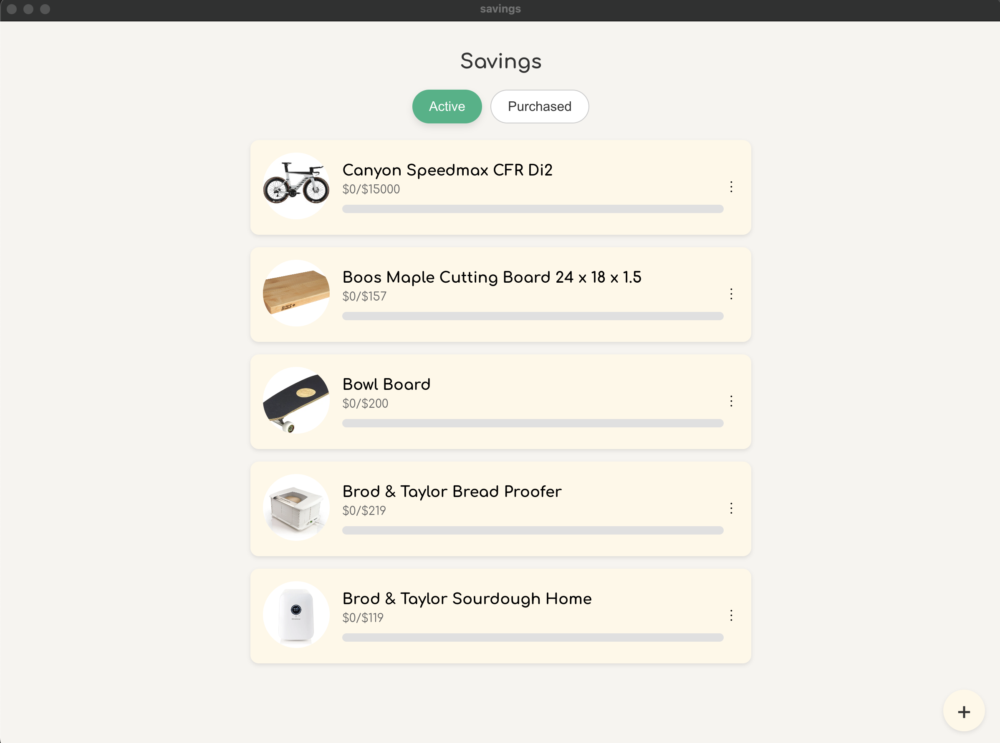

# Saving Tool

This is a simple crud electron-react app that uses local storage to keep a list of things that I want to purchase, and can keep track of my savings goals

## Running yourself
This was made for macos and to run and build do the following

`npm install`

`npm run build`

`npm run dist`

The dmg file will be generated inside of the directory and dist. You can then run it on your mac. 

## Resources

This medium article helped me get started:
https://medium.com/free-code-camp/building-an-electron-application-with-create-react-app-97945861647c

